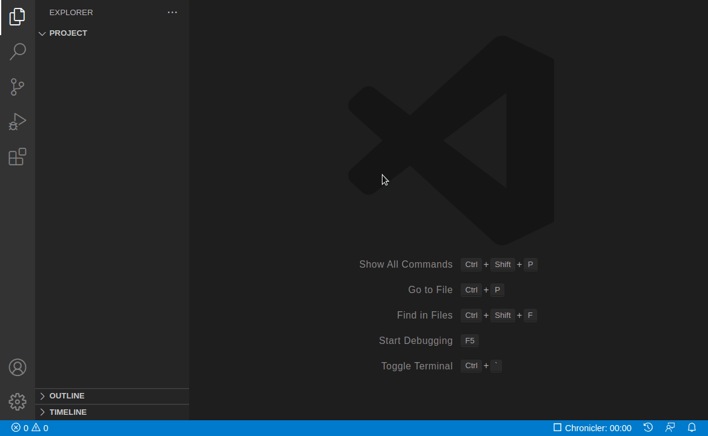
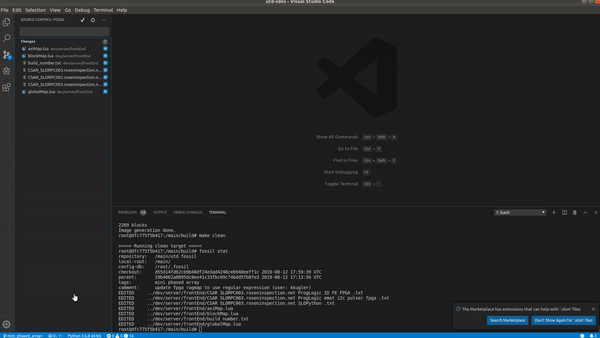

# Overview

## Integrated Fossil source control

### Prerequisites

> **Note**: This extension leverages your machine's Fossil installation, so you need to [install Fossil](https://www.fossil-scm.org) first.

## NOTE: WORK IN PROGRESS. NOT READY FOR RELEASE.

-----

# Features

* Add files and commit from the source control side-bar (i.e. where git normally appears).

* All the basics: commit, add, revert, update, push and pull.

* See changes inline within text editor.

* Interactive log for basic file history and diff.

* Branch, merge, resolve files.

* Quickly switch branches, push and pull via status bar.

* Supports named-branches workflows.

* Automatic incoming/outgoing counters.

* Undo

# Feedback & Contributing

* Please report any bugs, suggestions or documentation requests via the [Github issues](https://github.com/koog1000/vscode-fossil/issues) (_yes_, I see the irony).
* Feel free to submit [pull requests](https://github.com/mrcrowl/vscode-hg/pulls).

## Initialize a new repo

__TODO__: update gif for fossil

  * Just click the Fossil icon from the source control title area:

## Update to a branch/tag

__TODO__: update gif for fossil

  * The current branch name is shown in the bottom-left corner.
  * Click it to see a list of branches and tags that you can update to.

# Settings

`fossil.enabled { boolean }`

  * Enables Fossil as a source control manager in VS Code.

`fossil.pushPullScope { all / current / default }`

  * Specifies what to include in Push/Pull operations.
  * For named-branches mode: &nbsp;
  `"all"` &mdash; all branches / unrestricted (this is the default)
  `"current"` &mdash; only includes changesets for the current branch
  `"default"` &mdash; only includes changesets for the _default_ branch

`fossil.autoUpdate { boolean }`

  * Enables automatic update of working directory to branch head after pulling (equivalent to `fossil update`)
  `"true"` &mdash; enabled
  `"false"` &mdash; disabled, manual update/merge required

`fossil.autoInOut { boolean }`

  * Enables automatic counting of incoming/outgoing changes.
  * When enabled, these show in the status bar.
  * Updated every 3 minutes, or whenever a commit/push/pull is done.
  * Note: when `fossil.pushPullBranch` is set to `"current"` or `"default"` then only the respective branch will be included in the counts.

`fossil.autoRefresh { boolean }`

  * Enables automatic refreshing of Source Control tab and badge counter when files within the project change:
  `"true"` &mdash; enabled
  `"false"` &mdash; disabled, manual refresh still available.

`fossil.countBadge { tracked / all / off }`

  * Controls the badge counter for Source Control in the activity bar:
  `"tracked"` &mdash; only count changes to tracked files (default).
  `"all"` &mdash; include untracked files in count.
  `"off"` &mdash; no badge counter.

`fossil.allowPushNewBranches { boolean }`

  * Overrides the warning that normally occurs when a new branch is pushed:
  `"true"` &mdash; new branches are pushed without warning (default).
  `"false"` &mdash; shows a prompt when new branches are being pushed (e.g `fossil push --new-branch`)

`fossil.path { string / null }`

  * Specifies an explicit `fossil` file path to use.
  * This should only be used if `fossil` cannot be found automatically.
  * The default behaviour is to search for `fossil` in commonly-known install locations and on the PATH.

# Acknowledgements

[Ben Crowl](https://github.com/mrcrowl),
[ajansveld](https://github.com/ajansveld), [hoffmael](https://github.com/hoffmael), [nioh-wiki](https://github.com/nioh-wiki), [joaomoreno](https://github.com/joaomoreno), [nsgundy](https://github.com/nsgundy)