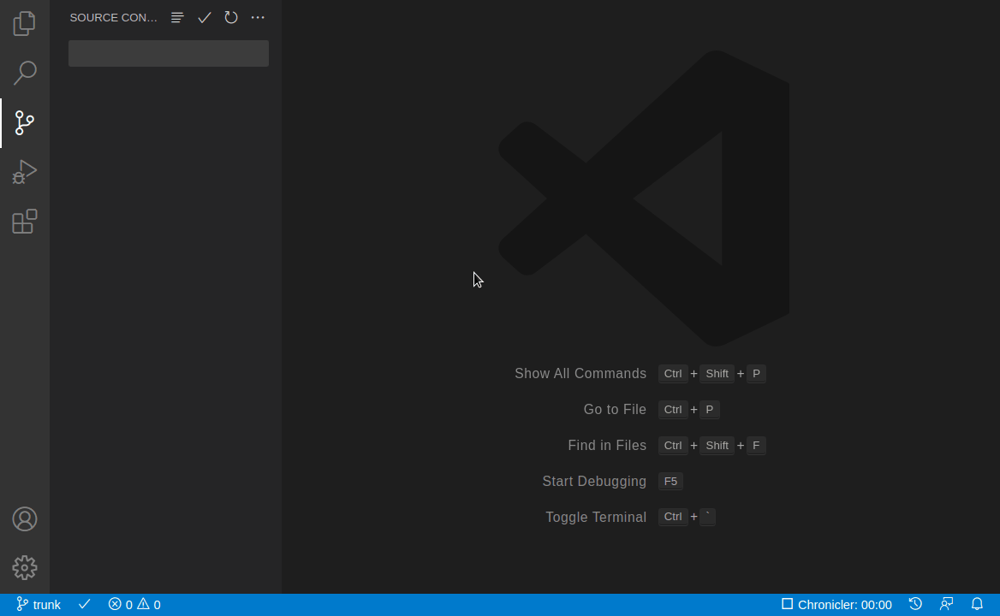

# Integrated Fossil source control for Visual Studio Code

### Prerequisites

> This extension leverages your machine's Fossil installation,
so you need to
[install Fossil](https://www.fossil-scm.org/fossil/doc/trunk/www/quickstart.wiki)
first. Also read the [cloning](/docs/cloning.md) documentation for info
about cloning from the extension.

# Features

* Add files and commit from the source control panel
  (i.e. where git normally appears).

* All the basics: commit, add, revert, update, push and pull.

* See changes inline within text editor.

* Interactive log for basic file history and diff.

* Branch, merge, resolve files.

* Praise

* Quickly switch branches, push and pull via status bar.

* Supports named-branches workflows.

* Automatic incoming/outgoing counters.

* Undo/Redo.

* Preview `md`, `wiki` and `pikchr` files

* Syntax highlighting for `pikchr` language

* Use command palette `Ctrl-Shift-P` >> `fossil:` to see all commands. (Not everything has a UI control.)

## View file changes

  * Click a file see the diff view
  * Or open a file by using context menu

## Initialize a new repo

  * Just click the Fossil icon from the source control title area
    * Follow prompts

## Update to a branch/tag

  * The current branch name is shown in the bottom-left corner.
  * Click it to see a list of branches and tags that you can update to.

# How to

* **Checkout by hash?**

  Use branch menu in the status bar.

* **Create a new branch?**

  Create a branch with "Commit Creating New Branch..." action in SCM menu or in command palette.

* **Modify commit message?**

  Use "Fossil log" from command palette and navigate the options till specific checkout.

* **Get current checkout hash or tags?**

  Hover over current branch name in the status bar

* **Close/reopen a branch?**

  Use 'Close branch...' and 'Reopen branch...' actions from command palette.

* **Commit partially**

  1. Run `Stash Snapshot` command
  2. Manually remove lines that you don't want in the commit
  3. Make a commit
  4. Run `Stash Pop`

* **Blame**

  Use `Fossil: praise` command from command palette

# Settings

`fossil.autoRefresh { boolean }`

  * Enables automatic refreshing of Source Control tab and badge counter
  when files within the project change:
  `"true"` &mdash; enabled
  `"false"` &mdash; disabled, manual refresh still available.

`fossil.path { string }`

  * Specifies an explicit `fossil` file path to use.
  * This should only be used if `fossil` cannot be found automatically.
  * The default behavior is to search for `fossil` on the PATH.
  * Takes effect immediately.

`fossil.username { string }`

  * Specifies an explicit user to use for fossil commits.
  * This should only be used if the user is different than the fossil default user.

`fossil.autoSyncInterval { number }`
  * The duration, in seconds, between each background `fossil sync` operation.
  * 0 to disable.

# Troubleshooting

In general, Fossil designers maintain an abundance of
[documentation](https://fossil-scm.org/home/doc/trunk/www/permutedindex.html).
Reference that documentation as much as possible.

| Issue | Resolution
--------|----------------------------------------------------------------
| Unknown certificate authority | Read the [Fossil SSL Documentation](https://fossil-scm.org/home/doc/trunk/www/ssl.wiki#certs) to update fossil with the correct CA |
| inputBox prompt difficult to read | Run the same fossil command on the built-in terminal (<code>Ctrl+`</code>). Unfortunately VS Code strips newlines and tabs from inputBox prompts. |

# Feedback & Contributing

* Please report any bugs, suggestions or documentation requests via the
[Github issues](https://github.com/koog1000/vscode-fossil/issues)
(_yes_, I see the irony).
* Feel free to submit
[pull requests](https://github.com/koog1000/vscode-fossil/pulls).

### For developers

* [Building and debugging](docs/dev/build.md)
* [Api behavior](docs/dev/api.md)
* [Releasing](docs/dev/release.md)

# Acknowledgements

[Ben Crowl](https://github.com/mrcrowl),
[koog1000](https://github.com/koog1000),
[senyai](https://github.com/senyai),
[ajansveld](https://github.com/ajansveld), [hoffmael](https://github.com/hoffmael), [nioh-wiki](https://github.com/nioh-wiki), [joaomoreno](https://github.com/joaomoreno), [nsgundy](https://github.com/nsgundy)
